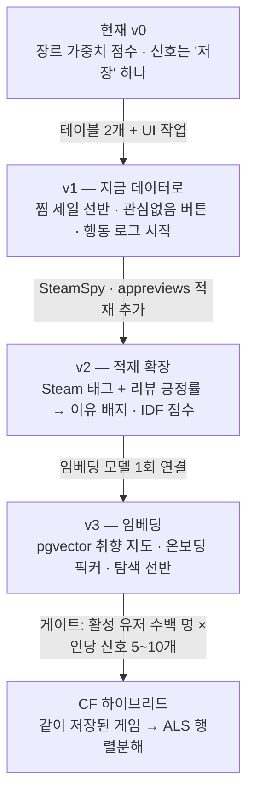
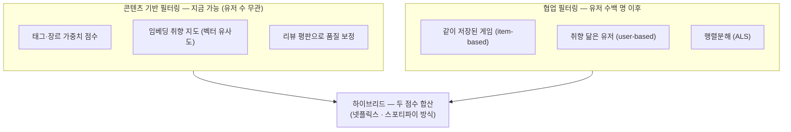
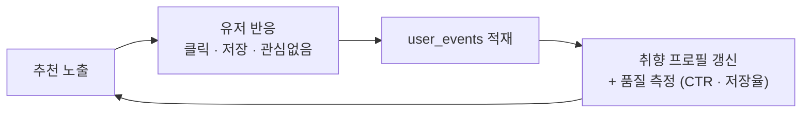
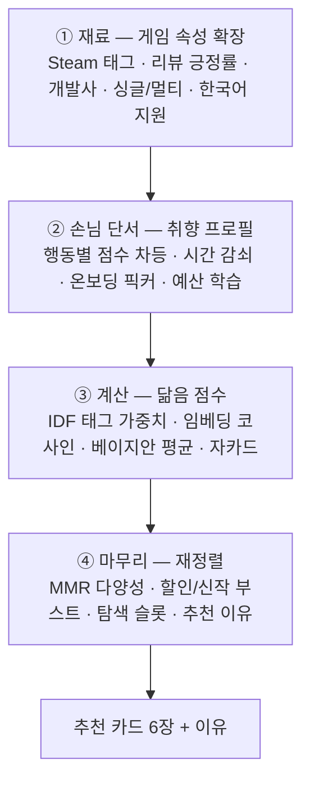
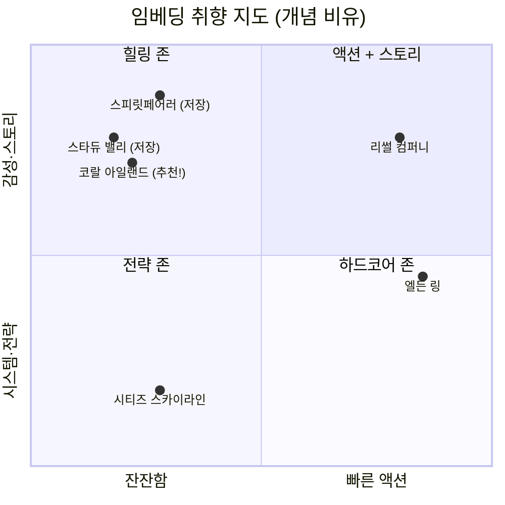

# 게임 추천 개인화 계획서

> 작성일: 2026-06-12
> 대상: gamemelier 프로젝트 (Next.js 16 App Router + Supabase + Steam ingest)
> 현황: 추천 v0(장르 가중치) 운영 중 → 단계적 개인화 고도화 계획
> 결정 사항: 콘텐츠 기반 필터링(CBF) 우선, `/recommend` 탭을 개인화 본진으로, v1→v2→v3→CF 단계 진행

---

## 0. 한눈에 보기 (TL;DR)

- **방식**: 콘텐츠 기반 필터링(CBF) 먼저 → 유저 데이터가 쌓이면 협업 필터링(CF) 추가 → 하이브리드.
- **본진**: 개인화 UI는 `/recommend` 탭에 집중. 홈은 비로그인 공용 콘텐츠 유지(추후 성과 좋은 선반 1개만 티저 승격 검토).
- **단계**: v1(지금 데이터로) → v2(태그·긍정률 적재) → v3(임베딩) → CF(유저 수백 명 이후).
- **지금 가장 중요한 것**: 행동 이벤트 로깅을 v1에서 시작. 지금 안 깔면 그 기간의 데이터는 영구 손실이고, 측정(클릭률·저장율) 없이는 개선 판단이 불가능.
- **인프라**: v1~v3 전부 기존 Supabase(Postgres·pgvector) + GitHub Actions cron 범위 안. 신규 인프라 0.



---

## 1. 용어 사전 (쉬운 설명)

| 용어 | 영문 | 뜻 |
|---|---|---|
| 콘텐츠 기반 필터링 | Content-Based Filtering (CBF) | "게임의 **내용**(태그·장르·설명)이 닮은 걸 추천". 유저가 적어도 동작 |
| 협업 필터링 | Collaborative Filtering (CF) | "**취향 비슷한 사람들**이 좋아한 걸 추천" (넷플릭스식). 유저가 많아야 동작 |
| 하이브리드 | Hybrid | CBF 점수 + CF 점수를 섞음. 실무 표준 |
| 콜드스타트 | Cold start | 유저/데이터가 없어 추천 시동이 안 걸리는 상태. 신규 서비스·신규 유저·신작 모두 해당 |
| 암묵 피드백 | Implicit feedback | 별점 같은 명시적 평가 대신 행동(클릭·저장·체류)으로 취향을 추정 |
| 임베딩 | Embedding | 게임을 "취향 좌표"(숫자 벡터)로 바꿔 **지도에 점 찍기**. 가까우면 비슷한 게임 |
| 코사인 유사도 | Cosine similarity | 두 좌표가 얼마나 가까운지 재는 계산법 |
| IDF 가중치 | Inverse Document Frequency | "흔한 태그(액션)는 약하게, 희귀 태그(덱빌딩 로그라이크)는 강하게" 점수 보정 |
| 베이지안 평균 | Bayesian average | 리뷰 5개 100%가 리뷰 5만 개 92%를 이기지 않도록, 표본이 적으면 평균 쪽으로 끌어내리는 보정 |
| MMR 재정렬 | Maximal Marginal Relevance | 추천 결과가 같은 부류로 도배되지 않게 다양성을 섞는 재정렬 |
| 탐색 슬롯 / 세렌디피티 | Exploration / Serendipity | 추천 N개 중 1~2개를 일부러 취향 밖에서 뽑아 새 취향 발견 + 반응 데이터 수집 |
| 온보딩 게임 픽커 | Onboarding game picker | 가입 직후 "재밌게 한 게임 3~5개 골라주세요" 화면. 첫날부터 취향 시드 생성 |
| 아이템 기반 CF | Item-based CF | "이 게임을 저장한 사람들이 **같이 저장한** 게임" (아마존식). CF 중 가장 적은 데이터로 동작 |
| 행렬분해 / ALS | Matrix Factorization / ALS | 유저×게임 표 전체를 학습해 숨은 취향 축을 자동 발견하는 본격 ML |
| pgvector | — | Postgres에서 벡터 저장·유사도 검색을 지원하는 확장. Supabase 기본 제공 |

---

## 2. 현재 상태 진단 (v0)

**현재 추천 흐름** (콘텐츠 기반 v1 수준):

1. 회원가입 시 장르 선택 → RPC `set_signup_genres` → `user_genre_preferences` 시드
2. 게임 저장 시 트리거 `trg_saved_games_weight` → `bump_weight_on_save`가 장르 가중치 누적
3. `/recommend`에서 RPC `recommend_games_cards`(장르 가중치 점수 + 예산 필터) 호출 → 카드 6장

**한계 3가지:**

| 한계 | 내용 |
|---|---|
| 신호 빈약 | 유저 신호가 "저장" 하나뿐. 부정 신호(관심 없음)·조회·노출 기록이 전무 → 정확도와 **측정** 모두 불가 |
| 아이템 변별력 부족 | 장르가 29종뿐이라 너무 거침. "힐링·소울라이크·덱빌딩" 같은 세밀한 구분 불가 |
| 측정 불가 | 추천이 좋아졌는지 판단할 지표(노출 대비 클릭률·저장율)가 없음 |

**발견된 버그** (별도 세션에서 수정 진행 중): `src/app/recommend/client.tsx`가 `useRecommendCards(ssrUserId, ssrLimit)`로 호출 → 훅 시그니처 `(userId, budgetCents, limit, excludeUpcoming)` 기준으로 카드 개수 6이 **예산 ₩0.06**으로 전달. SSR 프리페치 queryKey도 클라이언트와 불일치해 hydration이 버려짐.

---

## 3. 방식 선정: 왜 CBF 먼저인가

### 3.1 두 방식의 분류



- CBF 약점: 비슷한 것만 계속 나오는 **필터 버블** → MMR 다양성·탐색 슬롯으로 보완.
- CF 강점: 내용은 달라도 취향이 통하는 게임을 찾아내는 **세렌디피티** → 그래서 최종 형태는 하이브리드.

### 3.2 선정 이유 5가지

1. **데이터 현실에 맞는 유일한 방식 (콜드스타트)** — CF·ML은 유저 행동 데이터가 연료인데 현재 거의 없음. 억지로 먼저 도입하면 빈 추천이 나옴. CBF는 게임 속성만으로 유저 1명이어도 동작.
2. **이미 가진 것부터 (가성비)** — 할인율·장르·개발사·찜 목록은 DB에 이미 존재. v1은 새 적재·외부 서비스 없이 코드만으로 체감 기능("찜한 게임 세일 중")이 나옴. 실패해도 잃을 게 거의 없음.
3. **기록은 지금 시작하지 않으면 영구 손실** — CF로 넘어갈 시점에는 "이미 쌓인" 행동 기록이 필요. v1의 로깅은 미래 단계의 재료를 오늘부터 모으는 일이며, 동시에 클릭률·저장율로 개선 여부를 숫자로 판단 가능하게 함.
4. **1인 개발 리스크 관리** — v1→v2→v3 각 단계가 독립적으로 완결된 가치를 내고, "선반 하나 = 엔진 하나" 구조라 부분 배포·롤백이 쉬움. 인프라는 기존 Supabase + GitHub Actions 그대로.
5. **설명 가능성** — CBF는 "힐링 태그 일치", "'X'를 저장하셔서"처럼 추천 근거를 보여줄 수 있음. 초기 서비스의 신뢰 형성에 유리하고, 품질 문제 시 원인 추적도 가능. 블랙박스 모델로 시작하면 둘 다 불가.

### 3.3 데이터 선순환 (왜 로깅이 1순위인가)



이 루프가 돌기 시작해야 "추천 → 반응 → 더 나은 추천"의 선순환이 생긴다. 루프의 시작점이 로깅이다.

---

## 4. 추천 점수 설계 (CBF 부품 4층)

CBF는 단일 기법이 아니라 **부품을 끼우는 자리가 4군데 있는 조립식**이다.



**점수 조합 공식 (초기값, 추후 데이터로 튜닝):**

```
최종 점수 = (임베딩 취향 닮음 × 0.5) + (태그 일치 IDF 점수 × 0.3) + (품질 평판 × 0.2)
          → 이후 규칙 적용: 예산 필터 · 저장/소유 제외 · 할인/신작 부스트 · MMR 다양성 재정렬
```

**임베딩 취향 지도 (비유):** 게임의 이름+설명+태그를 모델에 넣으면 "취향 좌표"가 나오고, 비슷한 게임끼리 지도에서 가까이 모인다. 내가 저장한 게임들의 평균 위치가 "내 취향 위치"이고, 그 근처의 안 해본 게임을 추천한다.



> 좌표축 자체에 의미는 없다(실제는 수백~천 차원). "가까우면 비슷하다"가 핵심.

---

## 5. 데이터 모델 추가안

### 5.1 유저 행동 이벤트 (v1 — 모든 후속 단계의 연료)

```sql
create table user_events (
  id          bigint generated always as identity primary key,
  user_id     uuid    not null references auth.users(id) on delete cascade,
  game_id     bigint  references games(id) on delete cascade,
  event_type  text    not null check (event_type in
                ('impression','card_click','detail_view','save','unsave',
                 'dismiss','search_click','dwell')),
  value       real,            -- dwell ms, 검색 결과 위치 등
  source      text,            -- 'home' | 'recommend' | 'search' | 'related'
  session_id  uuid,
  created_at  timestamptz not null default now()
);
create index on user_events (user_id, created_at desc);
create index on user_events (game_id, event_type);
alter table user_events enable row level security;
-- RLS: 본인 행만 insert/select
```

### 5.2 명시/부정 피드백 (v1)

```sql
create table user_game_feedback (
  user_id    uuid   references auth.users(id) on delete cascade,
  game_id    bigint references games(id) on delete cascade,
  rating     smallint check (rating in (-1, 1)),
  dismissed  boolean default false,          -- '관심 없음'
  created_at timestamptz default now(),
  primary key (user_id, game_id)
);
```

### 5.3 게임 속성 확장 (v2)

```sql
alter table games
  add column positive_ratio    real,     -- 리뷰 긍정 비율
  add column total_positive    int,
  add column total_negative    int,
  add column review_score_desc text,     -- "Very Positive"
  add column ccu               int,      -- 동시 접속
  add column is_free           boolean,
  add column is_early_access   boolean;

create table tags (
  id   int primary key,
  name text not null
);
create table game_tags (
  game_id bigint references games(id) on delete cascade,
  tag_id  int    references tags(id),
  votes   int,                            -- SteamSpy 투표 수 (태그 강도)
  primary key (game_id, tag_id)
);
```

### 5.4 임베딩 (v3)

```sql
create extension if not exists vector;

create table game_embeddings (
  game_id    bigint primary key references games(id) on delete cascade,
  embedding  vector(1024),                -- 모델 차원에 맞춤
  updated_at timestamptz default now()
);
create index on game_embeddings using hnsw (embedding vector_cosine_ops);

alter table profiles add column taste_embedding vector(1024);  -- 저장 게임 임베딩의 가중평균
```

### 5.5 데이터 출처

| 데이터 | 출처 API | 키 | 비고 |
|---|---|---|---|
| 리뷰 긍정률 | `store.steampowered.com/appreviews/{appid}?json=1` | 불필요 | 기존 storefront 패턴과 동일. 레이트리밋 동일 취급(≈200/5분) |
| 유저 태그·동접 | SteamSpy `steamspy.com/api.php?request=appdetails&appid=` | 불필요 | appdetails에는 태그가 없음 → SteamSpy 필수 |
| 한국어 지원 | 기존 `game_raw_payloads.raw->supported_languages` | — | **이미 적재됨**, 컬럼 추출만 |
| 플레이 길이 | HowLongToBeat (비공식) | 불필요 | 선택사항 |
| 임베딩 | Voyage / OpenAI / 오픈소스(bge·e5) 중 택1 | 필요 | **Anthropic은 임베딩 API 미제공.** 미결정 |

> 적재는 `scripts/ingest-steam.ts`에 단계 추가. 429/403 대응·딜레이 패턴은 기존 코드 재사용. [steam-ingest-scheduling 메모 참조]

---

## 6. UI 계획 — `/recommend` 탭이 본진

### 6.1 왜 홈이 아니라 추천 탭인가

1. **역할 분리가 이미 그렇게 설계됨** — 홈 = 비로그인 포함 모두의 "발견"(인기작·출시예정), `/recommend` = 로그인 전용(GuestPage 게이트 기존재). 개인화는 로그인 전제라 추천 탭과 정확히 맞물림.
2. **측정이 깨끗함** — 노출·클릭률을 잴 표면이 하나면 개선 판단이 단순. 1인 개발에서 개인화 표면 2곳 유지는 낭비.
3. **홈은 다른 작업 대기 중** — LCP 개선·반응형 PR5와 독립적으로 진행 가능.

홈 승격은 엔진 검증 후 성과 좋은 선반 1개만 티저로(선택사항). 예외 배치: **게임 상세의 "비슷한 게임" 캐러셀**(보고 있는 게임이 기준이므로 상세 페이지), **온보딩 픽커**(가입 플로우 + 추천 탭 빈 상태에서 재사용).

### 6.2 추천 탭 구성 (선반 스택)

```
┌─ /recommend ──────────────────────────────────────────────┐
│ 취향 칩: [힐링 41%] [시뮬 27%] [전략 12%]                    │
│ 필터:   [예산] [한국어 지원] [할인 중만]                      │
├─ A. ○○님을 위한 추천 (6장) ── 이유 배지 + ♥/✕ ──────────────┤
│   [카드] [카드] [카드] [카드] [카드] [카드]                  │
├─ B. 'X'를 저장하셔서 ── 아이템 유사도 ───────────────────────┤
│   [카드] [카드] [카드] [카드]                                │
├─ C. 찜한 게임이 세일 중 ── 지금 데이터로 가능 ────────────────┤
│   [와이드 카드: 커버 · -75% · ₩19,800 → ₩4,950]             │
├─ D. 새로운 발견 (나중) ── 탐색 슬롯 ──────────────────────────┤
│   취향 밖 1~2개로 반응 데이터 수집                            │
├─ 빈 상태 (저장 0개 유저) ─────────────────────────────────────┤
│   선반 대신 게임 픽커: "재밌게 한 게임 3~5개를 골라주세요"      │
└──────────────────────────────────────────────────────────┘
```

핵심 패턴 3가지:

1. **선반(shelf)** — 근거가 다른 추천을 별도 줄로 분리. "선반 하나 = 엔진 하나"라 개발 단계와 UI가 1:1로 맞물림.
2. **이유 배지** — "힐링·농사 태그 일치", "'스타듀 밸리'를 저장하셔서". CBF의 설명 가능성을 UI로 옮긴 것. 탐색 슬롯은 "새로운 발견"으로 정직하게 라벨.
3. **피드백 버튼(♥/✕)** — 화면은 출력 장치이자 **수집 장치**. ✕(관심 없음)가 현재 전무한 부정 신호를 만들고, 노출(impression)·클릭 로깅이 측정을 가능하게 함.

### 6.3 기존 컴포넌트 매핑 (새 디자인 도입 없음)

| 계획 요소 | 실제 구현 |
|---|---|
| 선반 섹션 | `CardsGrid.tsx` 재사용 — 닉네임+제목 헤더(`text-purple2`) 패턴 기존재, 제목만 바꿔 반복 |
| 카드 | 기존 `Card` + `gradient-border-wrap` + Steam `header_image`(`aspect-[460/215]`) 그대로 |
| ♥ 버튼 | 기존 `saveToggleButton.tsx` 그대로 |
| ✕ 버튼 | SaveToggleButton과 동일 패턴의 라운드 아이콘 버튼 추가 (lucide `X`, `bg-gray-900`) |
| 이유/할인 배지 | shadcn `Badge` 수준 칩을 `CardContent`에 한 줄 추가 (다크 테마 + 보라 액센트) |
| 게임 픽커 | CardsGrid의 다중 선택 변형 — 선택 시 보라 테두리/체크 오버레이 |
| 반응형 | 기존 `mobile:/tablet:/desktop:` breakpoint 규약 준수 |

### 6.4 온보딩 게임 픽커

- **무엇**: 가입 직후 "재밌게 했던 게임을 3~5개 골라주세요" 화면 (넷플릭스 가입 시 작품 선택과 동일 패턴). 인기작 ~24개 그리드 + 다중 선택.
- **왜**: "RPG 좋아요"(장르 선택)보다 "스타듀 밸리 재밌었어요" 한 번이 정보량이 압도적 — 게임 하나에 장르+태그+가격대+분위기 수십 개 신호가 압축됨. 선택 게임의 태그/장르에 초기 가중치 적립, v3부터는 임베딩 평균 = 첫 취향 좌표 → **가입 첫날부터 추천 작동**(신규 유저 콜드스타트 해소).
- **위치**: 가입 플로우(기존 `set_signup_genres` 장르 선택을 대체/보완) + 추천 탭 빈 상태에서 재사용. 로드맵상 v3이지만 독립적이라 앞당기기 가능.

---

## 7. 측정 — 이게 없으면 개선도 없다

| 지표 | 정의 | 출처 |
|---|---|---|
| 추천 CTR | 노출(impression) 대비 카드 클릭 비율 | `user_events` |
| 추천 경유 저장율 | 추천 선반에서 클릭 → 저장으로 이어진 비율 | `user_events` + `user_saved_games` |
| 관심없음 비율 | 노출 대비 ✕ 클릭 — 높으면 해당 엔진/선반 점검 | `user_game_feedback` |

- v1에서 로깅을 깔고, v2/v3 배포 전후로 위 지표를 비교해 효과를 판단한다.
- 데이터가 충분해지면 오프라인 평가(recall@k)와 유저 버킷 A/B 테스트로 확장.

---

## 8. 단계별 작업 목록

### v1 — 지금 데이터로 (다음 작업)

- [ ] 마이그레이션: `user_events` + `user_game_feedback` (+ RLS) — `supabase/migrations/` 레포화와 함께 진행 권장
- [ ] 찜 세일 선반: `user_saved_games` × `game_prices`(discount_percent > 0) 조회 (RPC 또는 view)
- [ ] 게임 상세 "비슷한 게임" 캐러셀: 장르 겹침(자카드) 버전
- [ ] `/recommend` 선반 스택 개편: 기존 그리드 = 선반 A 유지 + 선반 C 추가
- [ ] 카드 ✕(관심 없음) 버튼 + `dismiss` 기록 → `recommend_games_cards`에서 dismissed 제외
- [ ] 노출/클릭 로깅 훅 (`impression`, `card_click`) — recommend 탭부터
- 전제: budgetCents 버그 수정(별도 세션) 머지 후 그 `client.tsx` 기준으로 작업

### v2 — 적재 확장

- [ ] `ingest-steam.ts`에 appreviews(긍정률) + SteamSpy(태그·ccu) 단계 추가
- [ ] `user_tag_preferences`(장르→태그 확장) + 트리거 확장 (행동별 차등: save +3 / detail_view +1 / dismiss −3, 시간 감쇠)
- [ ] `recommend_games_cards` v2: IDF 태그 점수 + 베이지안 평판 보정 + 할인/신작 부스트
- [ ] 이유 배지 + 선반 B("'X'를 저장하셔서") + 취향 요약 칩
- [ ] 한국어 지원 컬럼 추출(raw payload) + 필터 UI

### v3 — 임베딩

- [ ] 임베딩 모델 선정(Voyage/OpenAI/오픈소스) + ingest 배치(신규/변경 게임만)
- [ ] `game_embeddings` + `profiles.taste_embedding` + pgvector HNSW 인덱스
- [ ] 점수 합산에 코사인 유사도 반영 + MMR 다양성 재정렬 + 선반 D(새로운 발견)
- [ ] 온보딩 게임 픽커 (가입 플로우 + 추천 탭 빈 상태)

### CF — 게이트 통과 후 (활성 유저 수백 명 × 인당 신호 5~10개)

- [ ] 공동 저장 item-based CF (머티리얼라이즈드 뷰)
- [ ] implicit ALS 배치(GitHub Actions) → 잠재 벡터를 Postgres에 적재
- [ ] CBF + CF 하이브리드 점수, A/B 검증

---

## 9. 미결정 사항

| 항목 | 선택지 | 비고 |
|---|---|---|
| 임베딩 모델 | Voyage AI / OpenAI text-embedding-3-small / 오픈소스(bge·e5) | v3 시점에 비용·품질 비교 후 결정 |
| 픽커 도입 시점 | v3 기본 / 앞당김 가능 | 프런트 위주 작업이라 독립적 |
| 스키마 SQL 레포화 | `supabase/migrations/` | v1 마이그레이션과 함께 시작 권장 (기존 pending 항목) |
| 홈 티저 승격 | 엔진 검증 후 | 성과 좋은 선반 1개만 |
